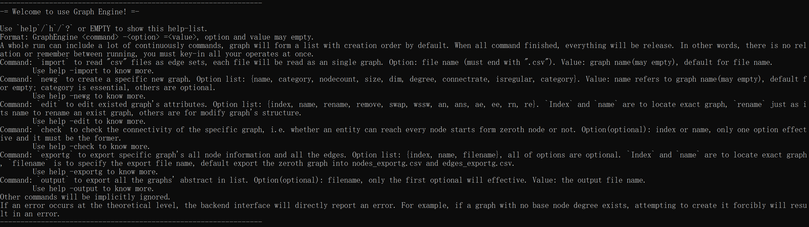

# GraphEngine
Simply process graphs/networks.\
*The release version only runs on Window-64*\

# Project Description
## Overview
**GraphEngine** is a modular C++ graph processing engine with a command-line interface (CLI), designed for **graph construction, editing, analysis, and export**. It supports multiple graph models, structural transformations, connectivity checks, and statistical analysis in a unified workflow. The project focuses on **engineering usability and correctness**, rather than isolated algorithm demonstrations.
***
## Motivation
In many graph-related projects, graph algorithms are often implemented as standalone functions with limited reusability and poor integration.\
GraphEngine was built to address this issue by providing:
- A unified graph abstraction
- A command-driven workflow for graph operations
- A reproducible and scriptable CLI interface
- Clear separation between theoretical constraints and I/O-level error handling\

The goal is to make graph experiments **repeatable, inspectable, and exportable**, rather than one-off executions.
***
## Key Features
### 1. Graph Construction
GraphEngine supports graph creation through both **file import** and **procedural generation**.
#### Import from CSV
- Read edge sets from CSV files
- Each file is parsed as an independent graph
- Supports directed and undirected graphs
- Imported graphs can be re-exported without loss
#### Procedural Generation
Supported graph categories include:
- Fully connected graphs
- Lattice graphs (arbitrary dimensions)
- Ring graphs
- Odd-degree regular graphs
- Erdős–Rényi (ER) random graphs
- Barabási–Albert (BA) scale-free graphs\

Each category accepts a dedicated set of parameters such as node count, degree, or dimension.
***
### 2. Graph Editing & Transformation
Graphs are stored internally as an ordered list and can be modified incrementally.\
Supported operations include:
- Rename, remove, and reorder graphs
- Add or remove nodes
- Add, edit, or remove edges
- Transform graphs into Watts–Strogatz small-world structures
- Structural updates with consistency checks\

All operations are performed via CLI commands and applied sequentially.
***
### 3. Graph Validation
GraphEngine provides connectivity checking capabilities:
- Verify whether all nodes are reachable from a base node
- Check a specific graph or all graphs in the current list\

This helps validate generated or edited graphs before analysis or export.
***
### 4. Graph Analysis & Statistics
GraphEngine can compute and export graph-level statistics, including:
- Node count and edge count
- Average degree and degree variance
- Clustering coefficient
- Minimum, average, and maximum shortest-path distances\

Statistics are exported in CSV format for further analysis or visualization.
***
### 5. Data Export
GraphEngine supports structured data export:
- **Graph structure export**
    - Node information
    - Full edge list with weights
    - Exported files are compatible with the import format
- **Graph summary export**
    - One-line abstract per graph
    - Suitable for batch comparison and analysis\

Exported files never overwrite existing files, ensuring data safety.
***
## Command-Line Interface Design
GraphEngine is operated entirely through a command-line interface:
- Commands can be chained in a single execution
- Each run is stateless: all operations must be specified explicitly
- Invalid input is handled with clear error messages
- The program terminates gracefully on theoretical or structural violations\

The CLI is designed to be **script-friendly and reproducible**, making it suitable for automated experiments.
***
## Design Principles
- Engineering-first design
- Clear separation between theoretical validation and I/O handling
- Minimal dependencies (standard C++ only)
- Explicit and reproducible workflows
***
## Limitations & Scope
To keep the project focused and maintainable, GraphEngine intentionally does **not** include:
- Parallel or multithreaded execution
- GUI or visualization
- Large-scale performance optimization
- External graph libraries

# Configuration
cmake minimum required: V3.25\
cmake standard: C++ 20\
MinGW version: 14.0 w64\
cmake exe linker flags: static\
The release version only runs on Window-64\
Open Source License: [MIT LICENSE](LICENSE)

# Interface Description
****
&emsp;&emsp;You can use this project to create a simple graph. You may choose unidirected or undirected mode, add nodes or edges. And even visit all the neighbors in index order. Edge has changeable weight, and whether node or edge can be added or removed.\
&emsp;&emsp;- **Graph(int nodeCount = 0, bool directed = false)** Create a new graph with `nodeCount` nodes(`default: 0`), and `directed` whether the edge is directed or not(`default: undirected`).\
&emsp;&emsp;- **bool isDirected() const** To get whether the edge is directed or not.\
&emsp;&emsp;- **int getNodeCount() const** To get the number of node(s) in the whole graph.\
&emsp;&emsp;- **int getEdgeCount() const** To get the number of edge(s) in the whole graph, every two nodes have no more than one undirected edge or two unidirected edge.\
&emsp;&emsp;- **const std::vector<std::pair<int, double>>& getNeighbors(int nodeIndex) const ** To get all the (outer) neighbor(s) of `nodeindex`.\
&emsp;&emsp;- **void addNode(); void addNodes(int count)** To append new (`count`) node(s).\
&emsp;&emsp;- **void addEdge(const std::tuple<int, int, double>& edge); void addEdges(const std::vector<std::tuple<int, int, double>>& edges)** To insert new edge(s) into graph. If the edge existed, it will only add the weight into existed edge.\
&emsp;&emsp;- **void updateEdgeWeight(const std::tuple<int, int, double>& newEdge); void updateEdgeWeights(const std::vector<std::tuple<int, int, double>>& newEdges)** To change edge(s)' weight if it has existed.\
&emsp;&emsp;- **void removeNode(int index); void removeNodes(std::vector<int> index)** Remove node(s) of `index` with all the related edges. _**Notice: This operate will change post-deleted nodes' index.**_\
&emsp;&emsp;- **void removeEdge(std::pair<int, int> neighborPair); void removeEdges(const std::vector<std::pair<int, int>>& neighborPairs)** Remove edge(s) of `neighborPair(s)` if existed.
#### Want to know more? See [Examples](Examples.md#examples-for-graphh---1).
***
&emsp;&emsp;You may use three classical algorithms (_**DFS, BFS and Floyd Warshall**_) to traversal graph.\
&emsp;&emsp;- **bool dfs(const Graph& graph)** To check whether the whole `graph` is *well-connected* or not.\
&emsp;&emsp;- **bool bfs(const Graph& graph, const std::pair<int, int>& objPair)** To search whether the `objPair`'s first node can reach the second one in `graph` or not.\
&emsp;&emsp;- **std::vector<std::vector<double>> floyd(const Graph& graph)** To calculate the minimal distance of every pair nodes in `graph` use *Floyd Warshall* algorithm. This algorithm is base on *Dynamic Programming* method, and can solve negative distance situation. **Negative loop is forbidden**.
#### Want to know more? See [Examples](Examples.md#examples-for-algorithmh---1).
***
&emsp;&emsp;Network's generator methods and stats are available.\
&emsp;&emsp;- You can use **gen.seed()** to specify the random number seed.\
&emsp;&emsp;- **Graph fullConnect(int nodeCount)** To generate a full connected graph with `nodeCount` nodes.\
&emsp;&emsp;- **Graph lattice(int size, int dim = 2)** To generate a squared grid or lattice structure with `dim` dimension and `size` side length.\
&emsp;&emsp;- **Graph ring(int nodeCount, int degree = 4)** To generate a ring structure with **even** degree(s), it has `nodeCount` node(s) and `degree` degree(s).\
&emsp;&emsp;- **Graph oddRegular(int nodeCount, int degree = 3)** To generate a regular graph with odd degrees (based on *ring*). Do _**not**_ try odd `nodeCount` here.\
&emsp;&emsp;- **Graph erRandom(int nodeCount, int averageDegree, double connectRate, bool isRegular = false)** To generate an Erdös-Rényi random network with `nodeCount` node(s) and `connectRate` connectivity. If `isRegular` is chosen as *True*, `averageDegree` will be active as average degree, and `connectRate` will be reconnected rate.\
&emsp;&emsp;- **void wsSmallWorld(Graph& graph, double reconnectRate)** To make the `graph`'s structure into Watts-Strogatz small world with `reconnectRate` reconnect rate.\
&emsp;&emsp;- **Graph baScaleFree(int nodeCount, int averageDegree)** To generate a Barabási-Albert scale free network with `nodeCount` node(s) and `averageDegree` average degree(s).\

&emsp;&emsp;- **std::pair<std::pair<double, double>, std::vector<double>> degreeDistribution(const Graph& graph)** To calculate the mean, variance, and distribution of the `graph`'s degree.\
&emsp;&emsp;- **double clusterCoefficient(const Graph& graph)** To calculate the cluster coefficient of the `graph`.\
&emsp;&emsp;- **std::tuple<double, double, double> distance(const Graph& graph)** To calculate the minimal, average and maximum distance of the `graph`, unreachable pairs will be **ignored**.
#### Want to know more? See [Examples](Examples.md#Examples-for-generatorh-and-statsh---1).
### Test file: [test.cpp](tests/test.cpp).

# Development Log
***
**2025-12-20 first**: Created the *Graph* class with attributes and method.\
**2025-12-20 second**: Tested the *Graph* class and _**fix bugs**_, such as edge count synchronization, add edges, and adjacency list.\
**2025-12-21 first**: Graph support the **edge's weight** now, the weight can be changed arbitrarily. Edge and node can be added or removed. When add an existed edge, it will be combined into weight with add operate.\
**2025-12-22 first**: **DFS, BFS and Floyd Warshall** algorithms are supported.\
**2025-12-24 first**: [_**Not yet tested**_]Network's generator, regular structure, Erdös-Rényi random network and Watts-Strogatz small world network are supported.\
**2025-12-25 first**: [_**Not yet tested**_]Network's generator, full-connect and Barabási-Albert Scale-Free network are supported. Network's stats, degree distribution, cluster coefficient(**undirected graph only**) and distance information are supported.\
**2025-12-26 first**: [_**Temporary upload**_]Incomplete testing and repair.\
**2025-12-27 first**: **Phased development completed.** Fix the out-of-bounds bugs, and code style turns into *CPP* instead of *C*.\
**2026-01-05 first**: **CLi** mode developed.\
**2026-01-05 second**: _**Release**_ edition published.
